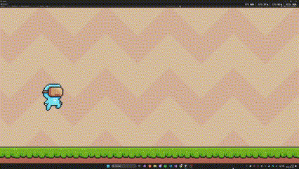
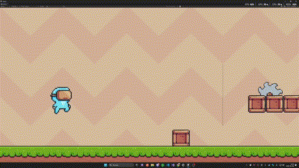

# 🕹️ Reinforcement Learning Agent in a 2D Platformer

This project demonstrates a 2D side-scrolling platformer game built in Unity, featuring an AI agent. The goal of the agent is to navigate through dynamic environments, avoid traps, and successfully reach the end of each level by learning through reinforcement learning (RL).

The game environment includes:

- Moving traps

- Obstacles like spikes and saws

- Randomized maps

- Increasing map length

Using observations, reward feedback, and a custom environment-agent communication interface, the agent gradually learns optimal movement strategies.

## 🎮 Overview

In this environment, the AI agent learns complex tasks such as:

- Jumping with precise timing

- Avoiding static and moving traps

- Efficiently navigating to a target location

To train the agent, we employed two state-of-the-art RL algorithms:

- 🔁 Proximal Policy Optimization (PPO)
  A reliable, policy-gradient method known for sample efficiency and robust performance in environments.

- ❄️ Soft Actor-Critic (SAC)
  A high-performing, entropy-regularized algorithm that encourages exploration.

## 📽️ Demo

| PPO Agent                      | SAC Agent                      |
| ------------------------------ | ------------------------------ |
|  |  |

## 🧠 Algorithms Used

- PPO (Proximal Policy Optimization): A policy gradient method known for stability and efficiency.

- SAC (Soft Actor-Critic): An off-policy actor-critic method using entropy regularization for better exploration.

## ⚙️ Setup & Installation

Install Unity and ML-Agents, setup MLAgents and virtual environment for learning.

Anaconda installation: https://github.com/Unity-Technologies/ml-agents/blob/develop/docs/Installation.md

ML-Agents installation: https://github.com/Unity-Technologies/ml-agents/blob/develop/docs/Installation-Anaconda-Windows.md

### 1. Clone Repository

```bash
git clone https://github.com/Mtjzsa/Thesis-AI-for-Platformer-game
cd your-repo-name
```

### 2. Setup Custom Trainer Configuration File

https://github.com/Unity-Technologies/ml-agents/blob/develop/docs/Training-Configuration-File.md

### 3. Training

After installations and creating a configuration file, start the virtual environment using Anaconda and type this for training.

```bash
mlagents-learn <trainer-config-file> --env=<env_name> --run-id=<run-identifier>
```

## 📌 Highlights

- Unity 2D game environment

- ML-Agents

- PPO

- SAC
